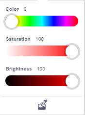

## ESP32 Easy Coding Board Stone Thrower Projects

### Code Download

[Click to download the code package](./Codes.zip).

### 1. Button Module

#### 1.1 Introduction

Button module is an input component for electronic devices, which is widely used in computers, mobile phones, home appliances and so on. It converts the physical button operation into electrical signals for reorganization and processing. It is composed of a button switch, a contact point, a conductive material and a circuit board.

#### 1.2 Schematic Diagram

Pressing or releasing the button changes the state of the circuit (high level: 1, low level: 0), so as to input information. 

For example in the circuit diagram, press the button and pin 1-3 and 2-4 are connected so that the s-end is pulled down to the ground, and the button value is `0` now. Release the button, pin 1-3 and 2-4 are disconnected, and s-end is pulled up by VCC and resistor R1, so the button value is `1`.

------

#### 1.3 Parameters

Operating voltage: DC 3.3-5V

Operating temperature: -10°C ~ +50°C

Dimensions: 31.6mmx23.7mm

Interface: 3PIN interface

Output signal: digital signal

------

#### 1.4 Wiring Diagram

#### 1.5 Test Code

1. In , drag 
2. In , drag  and set baud rate to `9600`
3. In , add  under 

4. In , put  into 
5. In , drag  and set pin to IO16. And put it in the printing box of 
6. For better observation, click  and find , set delay to 0.3S

**Complete Code**

**Test Result**

After uploading code, you can see the button value on the serial monitor of KidsBlock Desktop. 

Press the button and the value is `0`, and release it to change into `1`. If you cannot see the printing box, click  on KidsBlock.

#### 1.5 Expansion Code

Button controls the RGB dot matrix.

1. In , drag 
2. In , put  under 
3. In , put  under 
4. In , find  and put it into 
5. In , drag  and set the pin to IO16; and then add it into the condition box of 

6. In , drag , and modify color  to set it to red. Click  and choose . Put it into “then” of 
7. In , drag  and click  to set color to red  and set display icon to . Put it into “else” of 

**Complete Code**

**Test Result**

After uploading the code, ESP32 Easy Coding Board shows . Press the button, and it displays .

### 2. Rotary Potentiometer

#### 2.1 Introduction

Potentiometer module is essentially an adjustable resistor. When we rotate it, we change its resistance. We set up the corresponding circuit to convert the change in the resistance into a change in the voltage, which is then detected by the analog input port of the micro: bit board through the signal end.

#### 2.2 Schematic Diagram

#### 2.3 Parameters

Operating voltage: DC 3.3-5V

Operating temperature: -10°C ~ +50°C

Dimensions: 35mm x 20mm x 28mm

Interface: 3PIN interface

Output signal: analog signal

#### 2.4 Wiring Diagram

#### 2.5 Test Code

**Test Code**

1. In , drag 
2. In , drag  and set baud rate to `9600`
3. In , drag  and put it under 

4. In , drag  and put it into 
5. In , drag  and set pin to IO32, and put it intot the printing content box of 
6. For better observation, click  and add a , set the delay to 0.3S

**Complete Code**

**Test Result**

After uploading the code, KidsBlock Desktop serial monitor prints the analog values of the potentiometer. Rotate the potentiometer and these values change (range: 0-4095). If you cannot see the printing box, click  on KidsBlock.

#### 2.6 Expansion Code

Potentiometer controls the brightness of RGB dot matrix

**Expansion Code**

1. In , drag 
2. In , drag  and put it under 
3. In , drag  and set variable name to `value`, and put it under 
4. In , put  under 

5. In , drag  and set variable name to `value`, and put it into 
6. In , put  into 
7. In , drag  and set the pin to IO32, and put it into the first box of , modify the following box into `0`, `4095`, `0`, `255` respectively.

8. In , drag  and click  to set the color to red , set the icon to , and put it under 

9. In , drag  and input `value`, and put it into the  of 

**Complete Code**

**Test Result**

After uploading code, you may not see the  on the RGB dot matrix. Rotate the potentiometer to increase the brightness value of RGB, and the icon will show up.

### 3. Servo

#### 3.1 Introduction

The servo is a kind of position servo driver, which is mainly composed of housing, circuit board, core-less motor, gear and position detector. The receiver or microcontroller sends a signal to the servo which has an internal reference circuit that generates a reference signal with a period of 20ms and a width of 1.5ms, and compares the DC bias voltage with the voltage of the potentiometer to output voltage difference.

There are many specifications of servo, but they all contain three wires respectively in brown, red, and orange (colors may vary from brands). The brown is GND, the red is the positive power supply, and the orange is the signal line.

The rotation Angle of the servo is controlled by adjusting the duty cycle of the PWM (pulse width modulation) signals. Theoretically, the period of the standard PWM signal is fixed at 20ms (50Hz), so the pulse width should be 1ms ~ 2ms. But in fact, it is 0.5ms ~ 2.5ms, corresponding to the servo angle of  0° ~ 180°. 

#### 3.2 Parameters

Operating voltage: DC 3.3V〜5V

Operating angle range: approx. 180°(at 500→2500 μsec)

Pulse width range: 500→2500 μsec

No-load speed: 0.12±0.01 sec/60(DC 4.8V)    0.1±0.01 sec/60(DC 6V)

No-load current: 200±20mA(DC 4.8V)    220±20mA(DC 6V)

Stop torque: 1.3±0.01kg·cm(DC 4.8V)    1.5±0.1kg·cm(DC 6V)

Stop current: ≦850mA(DC 4.8V)    ≦1000mA(DC 6V)

Standby current: 3±1mA(DC 4.8V)    4±1mA(DC 6V)

#### 3.3 Wiring Diagram

#### 3.4 Test Code

**Test Code**

1. Import the servo library first. Click  and choose `Actuator`, find `Servo` library and load it.

After loading, click  to back to the main interface.

2. In , drag 
3. In , put  under 
4. In , drag  and set the pin to `IO14`, and angle to `0` degree, and modify the delay to `1000`(unit: ms), and put it into 
5. In , drag  and set the pin to `IO14`, and angle to `90` degree, and modify the delay to `1000` (unit: ms), and put it under the above block.
6. In , drag  and set the pin to `IO14`, and angle to `180` degree, and modify the delay to `1000` (unit: ms), and put it under the above block.

**Complete Code**

**Test Result**

After uploading the code, the servo rotates from 0 degree to 90 degree and then to 180 degree with intervals of 1 second of each.

#### 3.5 Expansion Code

Potentiometer controls the servo. Their wiring connections remains unchanged.

**Expansion Code**

1. In , drag 

   

2. In , drag  and set the variable name to `value`, and put it under 

3. In , put  under 

5. In , drag  and input variable name `value`, and put it into 
6. In , drag  and put it into 
7. In , drag  and set the pin to IO32, and put it into the first box of , and modify the following box into `0`, `4095`, `0`, `180` respectively.

8. In , drag  and set the pin to `IO14`, set the delay time to `10`(unit: ms), and put it under 

9. In , drag  and input variable name `value`, and put it into  of 

**Complete Code**

**Test Result**

After uploading the code, rotate the potentiometer to control the rotation of the servo from 0 degree to 180 degree. You can control it to stop at any angle. 

If your stone thrower are assembled, the servo controls the thrower arm and swings may appear when the potentiometer controls the it to 90 degree.

### 4. Ultrasonic Sensor

#### 4.1 Introduction

Like bats, HC-SR04 ultrasonic sensor adopts sonar to determine the distance to objects. It provides excellent contact-less range inspection with high accuracy and stable readings. Internally, it is equipped with ultrasonic transmitter and receiver. 

In application, it is used in a wide range of electronics projects for obstacle detection and distance measurement.

#### 4.2 Parameters

Operating voltage: 3.3-5V 

Static current: <2mA

Working current: 15mA

Valid angle: <15°

Distance range: 2cm – 400 cm

Accuracy: 0.3 cm

Measuring Angle: 30 degrees

Trigger input pulse width: 10 microseconds

#### 4.3 Wiring Diagram

| VCC(red) | Trig(white) | Echo(brown) | Gnd(black) |
| :------: | :---------: | :---------: | :--------: |
|   3V3    |  P8 / io4   | P12 / io15  |    GND     |

#### 4.4 Test Code

**Build code:**

1. Import ultrasonic library first. Click  to choose `Sensor`, find `Ultrasonic` and load it.

Successfully loaded. Click  to back to the main interface.

2. In , drag 
3. In , drag  and set baud rate to `9600`
4. In , drag  and put it under 

4. In , drag  and put it into 
5. In , drag  and set trig to pin IO4, echo to pin IO15, and put it into the print content box of 
6. For better observation, click  to add a  and set delay to 0.5S

**Test Result**

After uploading code, the serial monitor prints the distance value to the obstacles. If you cannot see the printing box, click  on KidsBlock.

#### 4.5 Expansion Code

**Expansion Code**

1. In , drag 

   

2. In , drag  and name the variable to `distance`, and put it under 

3. In , drag  and put it under 

5. In , drag  and modify the variable name to `distance` and put it in 
6. In , drag  and set trig to pin IO4, echo to pin IO15, and put it into the last box of 
7. In , put  under 
8. In , put  into the condition box of 
9. In , drag  and name it to `distance`, and put it into the left box of , modify the right box into `6`.

10. In , find  and , put them into 

    

11. At last add a delay of 0.3S under 

**Complete Code**

**Test Result**

After uploading code, when the ultrasonic sensor detects a distance to the object that is lower than 6CM, the on-board buzzer emits sound. You can test by pretending to be an obstacle with your hand.

### 5. Stone Thrower

#### 5.1 Introduction

In this project, we build a stone thrower with a button module, a potentiometer, an ultrasonic sensor and servos. 

#### 5.2 Wiring Table

Connections are the same, except the servo 2. Here is the wiring table.

|      Module       |     GND     |    VCC    |      S / Echo       |       Trig        |
| :---------------: | :---------: | :-------: | :-----------------: | :---------------: |
|      button       | GND (black) | 3V3 (red) | P9 / io16 (yellow)  |                   |
|   potentiometer   | GND (black) | 3V3 (red) | P2  / io32 (yellow) |                   |
|  servo 1 (base)   | GND (brown) | 3V3 (red) | P0  / io12 (yellow) |                   |
|   servo 2 (arm)   | GND (brown) | 3V3 (red) | P1  / io14 (yellow) |                   |
| ultrasonic sensor | GND (black) | 3V3 (red) | P12  / io15 (brown) | P8  / io4 (white) |

#### 5.3 Test Code

#### 5.4 Test Result

After uploading the code, rotate the potentiometer to adjust the angle of the thrower arm. 

When the distance of the obstacle in front  is less than 20CM, stones can be projected. Pressing the button to project stones. 

------

## 2.FAQ

### Q: Battery model?

A: Four AAA batteries. Please install the batteries in the correct direction rather than reverse them! For younger students, please be accompanied by your parents!

------

### Q: Error occurs when burning programs on ESP32 board?

A: 

- Please check whether the USB port number is correct.
- Please ensure the main board model is available. 

------

### Q: Expand to external modules?

A: It can expand to external modules. For details, please follow the ESP32 pin instructions to ensure external modules can normally work.

------

## 3. Resources

Keyestudio official:

[https://www.keyestudio.com/](https://www.keyestudio.com/)

Keyestudio wiki main page:

[https://wiki.keyestudio.com/Main_Page](https://www.keyestudio.com/)

Arduino official:

[https://www.arduino.cc/](https://www.keyestudio.com/)

ESP32 espressif official:

[https://www.espressif.com/](https://www.keyestudio.com/)
