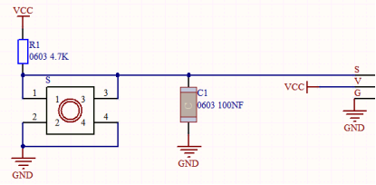
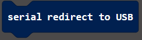
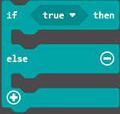
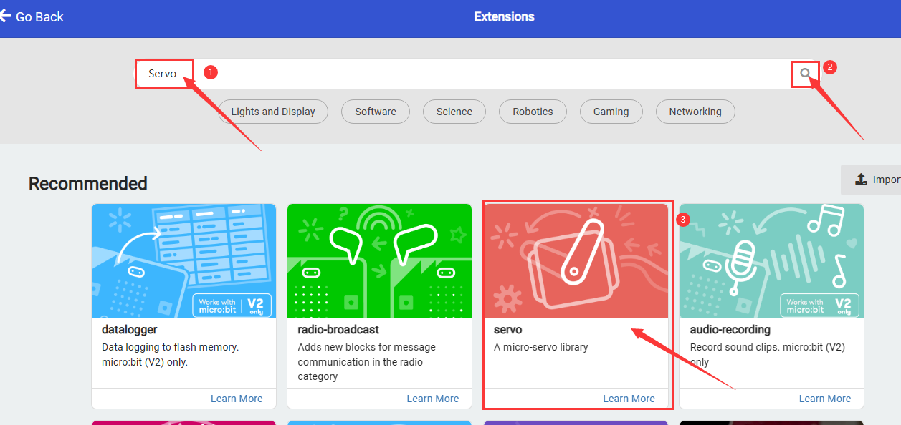
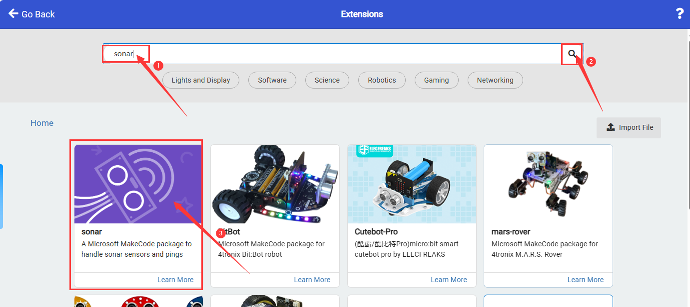
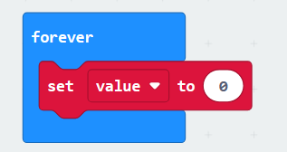
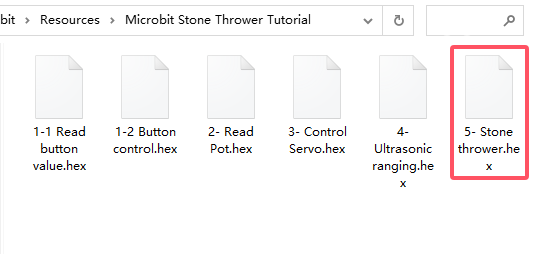
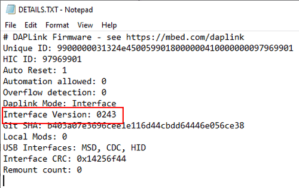

# Micro:bit Stone Thrower Projects

## Code Download

[Click to download the code package](./Resources.zip).

### 1. Button Module

#### 1.1 Introduction

Button module is an input component for electronic devices, which is widely used in computers, mobile phones, home appliances and so on. It converts the physical button operation into electrical signals for reorganization and processing. It is composed of a button switch, a contact point, a conductive material and a circuit board.

#### 1.2 Schematic Diagram

Pressing or releasing the button changes the state of the circuit (high level: 1, low level: 0), so as to input information. 

For example in the circuit diagram, press the button and pin 1-3 and 2-4 are connected so that the s-end is pulled down to the ground, and the button value is `0` now. Release the button, pin 1-3 and 2-4 are disconnected, and s-end is pulled up by VCC and resistor R1, so the button value is `1`.

------

#### 1.3 Parameters

Operating voltage: DC 3.3-5V

Operating temperature: -10°C ~ +50°C

Dimensions: 31.6mmx23.7mm

Interface: 3PIN interface

Output signal: digital signal

------

#### 1.4 Wiring Diagram

------
#### 1.5 Test Code

**Load the code from computer:**

Download the code package first, and unzip and upload the code to micro bit board. If you do not know how to do it, please [learn how to upload code in basic projects](./Basic_Courses.md#3.5.1导入代码).

**Build the code blocks manually:**

1. In , drag  into 

2. In , put  into  and modify the write value to `val:`
3. In , add a  and choose pin P9, and put it into the last box of 

4. In , add a delay  under the , and set delay to 100ms

**Complete code:**

------

**Test result:**

After uploading code, you can see the button value on the serial monitor. If you are a Windows10 System user, the values can be displayed online via WebUSB.

If values cannot be displayed via WebUSB, you may need a serial tool. [Click to learn how to use a serial tool in basic projects](./Basic_Courses.md#3.5.2CoolTerm软件安装).

After uploading code, open the CoolTerm and click **Options**, click **SerialPort** to choose the COM port and set baud rate to 115200 (the tested USB serial baud rate of Micro:bit board is 115200). Click **OK** and **Connect**.

Now you can see the button value on the serial monitor, and these results will be refreshed every 0.2s.

#### 1.6 Extension Code

**Load the code from computer:**

Download the code package first, and unzip and upload the code to micro bit board. If you do not know how to do it, please [learn how to upload code in basic projects](./Basic_Courses.md#3.5.1导入代码).

**Build the code blocks manually:**

1. In , add a  into the 

.png)

2. In , add a  into 

3. In , put  into the condition box of 

4. Click  and find , drag  and set the pin to `P9` and put it in the left box of the . Modify the right box into `1`. That is: `P9 = 1`

5. In , put  under “then” 
6. In , put  under “else” 

**Complete code:**

**Test result:**

After uploading code, the micro bit board dot matrix will show . Press the button and it displays . Release the button and it shows back to .

------

### 2. Rotary Potentiometer

#### 2.1 Introduction

Potentiometer module is essentially an adjustable resistor. When we rotate it, we change its resistance. We set up the corresponding circuit to convert the change in the resistance into a change in the voltage, which is then detected by the analog input port of the micro: bit board through the signal end.

#### 2.2 Schematic Diagram

#### 2.3 Parameters

Operating voltage: DC 3.3-5V

Operating temperature: -10°C ~ +50°C

Dimensions: 35mm x 20mm x 28mm

Interface: 3PIN interface

Output signal: analog signal

#### 2.4 Wiring Diagram

#### 2.5 Test Code

**Load the code from computer:**

Download the code package first, and unzip and upload the code to micro bit board. If you do not know how to do it, please [learn how to upload code in basic projects](./Basic_Courses.md#3.5.1导入代码).

**Build the code blocks manually:**

1. In , put  into 

2. In , put  into , and modify the write value to `Pot:`
3. In , add a  and set the pin to P2, and put it into the last box of 

4. In , add a delay  under  and set to 200ms

**Complete code:**

#### 2.6 Test Result

After uploading code, you can see the analog values of the potentiometer. If you are a Windows10 System user, the values can be displayed online via WebUSB.

If values cannot be displayed via WebUSB, you may need a serial tool. [Click to learn how to use a serial tool in basic projects](./Basic_Courses.md#3.5.2CoolTerm软件安装).

After uploading code, open the CoolTerm and click **Options**, click **SerialPort** to choose the COM port and set baud rate to 115200 (the tested USB serial baud rate of Micro:bit board is 115200). Click **OK** and **Connect**.

Now you can see the analog values of the potentiometer on the serial monitor, and these results will be refreshed every 0.2s.

### 3. Servo

#### 3.1 Introduction

The servo is a kind of position servo driver, which is mainly composed of housing, circuit board, core-less motor, gear and position detector. The receiver or microcontroller sends a signal to the servo which has an internal reference circuit that generates a reference signal with a period of 20ms and a width of 1.5ms, and compares the DC bias voltage with the voltage of the potentiometer to output voltage difference.

There are many specifications of servo, but they all contain three wires respectively in brown, red, and orange (colors may vary from brands). The brown is GND, the red is the positive power supply, and the orange is the signal line.

The rotation Angle of the servo is controlled by adjusting the duty cycle of the PWM (pulse width modulation) signals. Theoretically, the period of the standard PWM signal is fixed at 20ms (50Hz), so the pulse width should be 1ms ~ 2ms. But in fact, it is 0.5ms ~ 2.5ms, corresponding to the servo angle of  0° ~ 180°. 

#### 3.2 Parameters

Operating voltage: DC 3.3V〜5V

Operating angle range: approx. 180°(at 500→2500 μsec)

Pulse width range: 500→2500 μsec

No-load speed: 0.12±0.01 sec/60(DC 4.8V)    0.1±0.01 sec/60(DC 6V)

No-load current: 200±20mA(DC 4.8V)    220±20mA(DC 6V)

Stop torque: 1.3±0.01kg·cm(DC 4.8V)    1.5±0.1kg·cm(DC 6V)

Stop current: ≦850mA(DC 4.8V)    ≦1000mA(DC 6V)

Standby current: 3±1mA(DC 4.8V)    4±1mA(DC 6V)

#### 3.3 Wiring Diagram

#### 3.4 Test Code

**Load the code from computer:**

Download the code package first, and unzip and upload the code to micro bit board. If you do not know how to do it, please [learn how to upload code in basic projects](./Basic_Courses.md#3.5.1导入代码).

**Build the code blocks manually:**

1. Click  to import the servo library

2. Search “Servo” and click , and you can see the Servo extension. Click to load it.

3. Successfully loaded.

4. In ,  put  into , and set pin to P1 and angle to 0°.

5. In , add  under  and set the delay to 1000ms

6. repeat step 4 and 5, set the servo angle to 90° and 180° with delays of 1000ms

**Complete code:**

#### 3.5 Test Result

After uploading code, the servo rotates from 0 degree to 90 degree and then to 180 degree with intervals of 1 second of each.

------

### 4. Ultrasonic Sensor

#### 4.1 Introduction

Like bats, HC-SR04 ultrasonic sensor adopts sonar to determine the distance to objects. It provides excellent contact-less range inspection with high accuracy and stable readings. Internally, it is equipped with ultrasonic transmitter and receiver. 

In application, it is used in a wide range of electronics projects for obstacle detection and distance measurement.

#### 4.2 Parameters

Operating voltage: 3.3-5V 

Static current: <2mA

Working current: 15mA

Valid angle: <15°

Distance range: 2cm – 400 cm

Accuracy: 0.3 cm

Measuring Angle: 30 degrees

Trigger input pulse width: 10 microseconds

#### 4.3 Wiring Diagram

| VCC(red) | Trig(white) | Echo(brown) | Gnd(black) |
| :------: | :---------: | :---------: | :--------: |
|   3V3    |  P8 / io4   | P12 / io15  |    GND     |

#### 4.4 Test Code

**Load the code from computer:**

Download the code package first, and unzip and upload the code to micro bit board. If you do not know how to do it, please [learn how to upload code in basic projects](./Basic_Courses.md#3.5.1导入代码).

**Build the code blocks manually:**

1. Click  to load ultrasonic library.

2. search `sonar` and click . You can see the `sonar` library, click to load it.

3. successfully loaded.

4. In , add  into 

5. In , click  to define a variable named `value`.

6. In , add  into 

7. In , add  into the value box of , and set Trig to pin P8, echo to pin P12, and unit to CM

8. In , add  under , and set the write value to “distance=”

9. In , find  and put it into the last box of 

10. In , add a delay  under  and set to 500ms

**Complete code:**

#### 4.5 Test Result

After uploading code, you can see the distance values detected by the ultrasonic sensor on the serial monitor. If you are a Windows10 System user, the values can be displayed online via WebUSB.

If values cannot be displayed via WebUSB, you may need a serial tool. [Click to learn how to use a serial tool in basic projects](./Basic_Courses.md#3.5.2CoolTerm软件安装).

After uploading code, open the CoolTerm and click **Options**, click **SerialPort** to choose the COM port and set baud rate to 115200 (the tested USB serial baud rate of Micro:bit board is 115200). Click **OK** and **Connect**.

------

### 5. Stone Thrower

#### 5.1 Introduction

In this project, we build a stone thrower with a button module, a potentiometer, an ultrasonic sensor and servos. 

#### 5.2 Wiring Table

Connections are the same, except the servo 2. Here is the wiring table.

|      Module       |     GND     |    VCC    |      S / Echo       |       Trig        |
| :---------------: | :---------: | :-------: | :-----------------: | :---------------: |
|      button       | GND (black) | 3V3 (red) | P9 / io16 (yellow)  |                   |
|   potentiometer   | GND (black) | 3V3 (red) | P2  / io32 (yellow) |                   |
|  servo 1 (base)   | GND (brown) | 3V3 (red) | P0  / io12 (yellow) |                   |
|   servo 2 (arm)   | GND (brown) | 3V3 (red) | P1  / io14 (yellow) |                   |
| ultrasonic sensor | GND (black) | 3V3 (red) | P12  / io15 (brown) | P8  / io4 (white) |

#### 5.3 Test Code

**Load the code from computer:**

Download the code package first, and unzip and upload the code to micro bit board. If you do not know how to do it, please [learn how to upload code in basic projects](./Basic_Courses.md#3.5.1导入代码).

**Build the code blocks manually:**

**Complete code:**

.png)

#### 5.4 Test Result

------

## Troubleshooting

### 1. Code fails to download to Micro:bit

#### Problem

Recently, many users encounter the issue that Micro:bit board doesn’t respond when download code.

If the way you operate is correct, maybe you accidentally press the reset button and enter the Maintenance mode or the firmware is lost due to mis-operation.

Plug in Micro:bit board, the “MAINTENANCE” drive appears, which means the program can’t be downloaded.

#### Solution

1. Download the **hex file** from this page to your computer.

	Down load the latest micro:bit firmware-0255: https://www.microbit.org/get-started/user-guide/firmware/ 
	If you do not want to download from this website, we also provide it in our tutorial.

2. After the latest firmware is downloaded, then drag it into the “MAINTENANCE” to make Micro:bit back to normal mode.

#### Avoid to Enter “MAINTENANCE”

1. Make sure the Reset button is **not** pressed when plugging the board by USB cable.

  
        

2. Don't unplug the cable suddenly during downloading micro:bit program, otherwise, the firmware will be lost and micro:bit will enter “MAINTENANCE” mode.
3. In the experiment, wrong wiring also cause a short circuit or firmware lost.

------

### 2.Troubleshooting-Download with WebUSB

Having trouble pairing the Micro: bit with WebUSB (/ device/usb/webusb)?

#### Step 1: Check cable

Make sure that your micro:bit is connected to your computer with a micro USB cable. You should see a **MICROBIT** drive appear in Windows Explorer when it’s connected.

**If you can see the MICROBIT, please go to step 2**.

If you can’t:

- Make sure that the USB cable is working. Does the cable works on another computer? If not, find a different cable to use. Some cables may only provide a power connection and don’t actually transfer data.
- Try another USB port on your computer. 
- Is the cable good but you still can’t see the **MICROBIT** drive? Hmm, you might have a problem with your micro:bit. 
- Try the additional steps described in the [falut finding](https://support.microbit.org/support/solutions/articles/19000024000-fault-finding-with-a-micro-bit) at microbit.org.
- If this doesn’t help, you can create a [support ticket](https://support.microbit.org/support/tickets/new) to notify the Micro:bit Foundation of the problem. If you do so, **skip the rest of these steps**.

------

#### Step 2: Check firmware version

It’s possible that the firmware version on the micro:bit needs an update. Let’s check:

1. Go to the **MICROBIT** drive.
2. Open the **DETAILS.TXT** file.

3. Look for the version number. It should say **Version: ...**

	

	Or **Interface Version: ...**

	

If the version is **0234**, **0241**, **0243**, you need to update the firmware on your micro:bit. Go to **Step 3** and follow the upgrade instructions.

If the version is **0249**, **0250** or higher, you have the right firmware, just go to **step 4**.

------

#### Step 3: Update firmware

1. Put your micro:bit into **MAINTENANCE Mode**. 

	To do this, please unplug the USB cable from the micro:bit and then re-connect the USB cable after pressing and holding the reset button. Once you insert the cable, you can release the reset button. You should now see **MAINTENANCE** instead of the **MICROBIT** drive. Also, a yellow LED indicator will stay on. 

2. Download firmware .hex file: <https://microbit.org/guide/firmware/>
3. Drag the file into the **MAINTENANCE** drive.
4. The yellow LED will flash while the HEX file is copying. After that, the LED will go off and the micro:bit resets. The **MAINTENANCE** drive now changes to **MICROBIT**.
5. The upgrade is complete! You can open the **DETAILS.TXT** file to check the firmware version that matches the one of the **HEX** file you copied.

If you want to know more about connecting the board, MAINTENANCE Mode, and upgrading the firmware, please refer to [Firmware guide](https://microbit.org/guide/firmware/).

------

#### Step 4: Check version of Browser

WebUSB may require you to update your browser. 

Check that your browser version matches one of these: **Android**, **Chrome OS**, **Linux**, **macOS** and **Windows 10 Chrome 65+**.

------

#### Step 5: Pair device

Once you’ve updated the firmware, open the **Chrome Browser**, go to the editor and click on **Pair Device** in settings. 

See [WebUSB](https://microbit.org/get-started/user-guide/web-usb/) (/ device / usb / webusb) for pairing instructions.

------

## Resources

Keyestudio official:

[https://www.keyestudio.com/](https://www.keyestudio.com/)

Keyestudio wiki main page:

[https://wiki.keyestudio.com/Main_Page](https://www.keyestudio.com/)

MicrobitCode：

<https://makecode.microbit.org/>

Microbit official:

<https://www.microbit.org/>