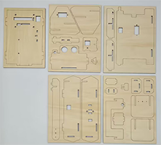
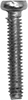
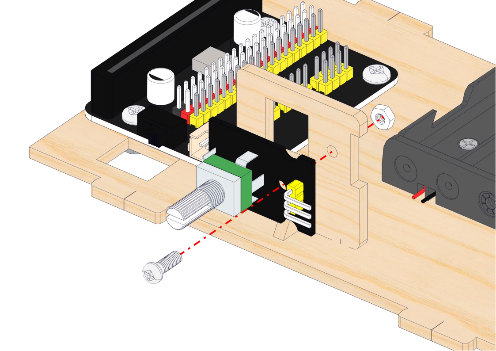
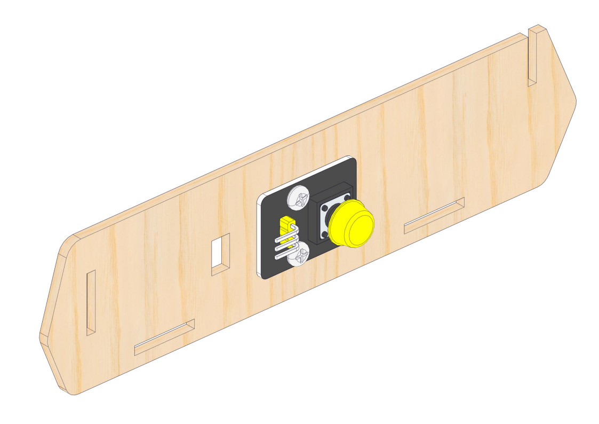
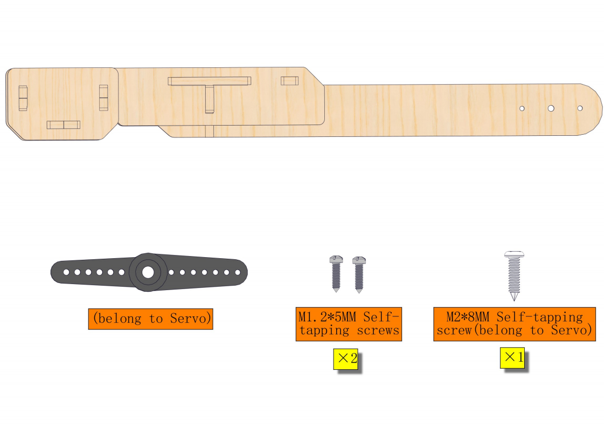

**Thank you for choosing keyestudio!**

**We will endeavor to provide you with better products and services!**

------

**About Keyestudio**

Keyestudio is the best-selling brand owned by KEYES Corporation. Our product contains Arduino development and expansion boards, sensors and modules, Raspberry Pi, micro:bit expansion boards as well as smart cars and learning kits, which can help customers at any level to learn about Arduino.

Notably, all of our products are in line with international quality standards and are greatly appreciated in a broad menu of different markets across the world.

Welcome to check out more contents from our official website:

[http://www.keyestudio.com](http://www.keyestudio.com)

------

**Obtain Information and After-sales Service**

1. If something is found missing or broken, or you have some difficulty learning the kit, please feel free to contact us. Welcome to send email to us: [service@keyestudio.com](http://m.138.gz.cn/webadmin/~CAmsnCrrNXhTAySKCerrIfWjjZuuWVfI/~/usr/mod_edituser.jsp?;uid=service@keyestudio.com;;clearCache=)

2. We will endeavor to update projects and products continuously from your sincere advice! Thanks!

------

**Warning**

1. This product contains tiny pin headers, so please keep out of reach of children under 7 to prevent from lacerations. 
2. This product also contains conductive parts(control board and electronic modules). Please operate according to the requirements of tutorials. Otherwise, improper operation may damage parts due to overheating. In this case, do not touch it and immediately disconnect the circuit power.

------

**Copyright**

The Keyestudio trademark and logo are the copyright of **KEYES DIY ROBOT co.,LTD**. All products under Keyestudio brand can’t be copied, sold or resold without authorization by anyone or any company.

If you are interested in our products, please contact to our sales representatives:

[fennie@keyestudio.com](http://m.138.gz.cn/webadmin/~CAmsnCrrNXhTAySKCerrIfWjjZuuWVfI/~/usr/mod_edituser.jsp?;uid=fennie@keyestudio.com;;clearCache=)

------

# STEM Programming DIY Stone Thrower Learning Kit

------

## Kit List

**Please check the list to ensure that all parts are intact. If you find missing ones, please contact our sales staff immediately.**

|  #   |                             PIC                              |            NAME             | QTY  |
| :--: | :----------------------------------------------------------: | :-------------------------: | :--: |
|  1   |                                        |       Expansion board       |  1   |
|  2   |                                        |       Battery holder        |  1   |
|  3   |                                       |       Basswood board        |  1   |
|  4   |                                       |    Rotary Potentiometer     |  1   |
|  5   |                                       |        Button module        |  1   |
|  6   |                                         |            Servo            |  2   |
|  7   |                                         |      Ultrasonic sensor      |  1   |
|  8   |                                         |   HX-2.54 4P DuPont wire    |  1   |
|  9   |                                         |       3P DuPont wire        |  2   |
|  10  |                                        |         Screwdriver         |  1   |
|  11  |  |        M4x8MM screw         |  6   |
|  12  |                                       |           M4 nut            |  6   |
|  13  |                |          M2.5 nut           |  2   |
|  14  |                |       M2.5x8MM screw        |  2   |
|  15  |                                         |        M3x8MM screw         |  1   |
|  16  |                                       |           M3 nut            |  1   |
|  17  |  |        M2x10MM screw        |  4   |
|  18  |  |           M2 nut            |  4   |
|  19  |  | M1.2x5MM Self-tapping screw |  4   |
|  20  |                                                              |                             |      |

------

## Description

With bass wood as its structural material, we specially design a stone thrower learning kit.

This kit integrates two servos, a potentiometer, an ultrasonic sensor and a button module, which are compatible with micro:bit boards and ESP32 Easy Coding Boards. We write codes via Makecode and KidsBlock to achieve multiple creative and interesting functions.

With this kit, you can master basic sensor knowledge and have an excellent opportunity to learn programming. Except for the structure of the stone thrower, it is also a perfect combination of learning and entertainment which stimulates your creativity and talent.

------

## Features

1. **Simple assembly:** For convenience, the assembly is easy and simple so that you may complete installations quickly.
2. **Experience of stone thrower:** You can “throw stones” with the machine and learn related knowledge during the experience.
3. **Combination of programming and stone thrower:** It integrates stone thrower with programming, providing you with a novel and creative programming experience.
4. **Multiple programming:** Makecode and KidsBlock programming are available, which meet the diversified programming needs and expand the range of learning.

------

## Assembly

ATTENTION: If you are a beginner, please learn the Micro bit Basic Projects first. The angle of the servo need to be set before assembling. You may not know how to do it without the basic projects.

### Mount battery holder and the expansion board

### Mount the potentiometer and the button

### Mount the base of the stone thrower and the servo

#### Set the servo angle to 90°

The angle must be set before mounting following parts. Or else the servo may be damaged.

Connect the servo to the expansion board.

[Click to download the code folder](./codes.zip) of the relevant development board.

Micro:bit board code file:

ESP32 development board code file: 

If you do not know how to upload code to the board, [click to learn the basic projects](https://docs.keyestudio.com/projects/KS0807/en/latest/docs/index.html#basic-projects).

After uploading the code, the servo rotates from 0 degree to 180 degree and to 90 degree. You can press the service button on the development board to have a clear look. If your servo gets no response, please check whether the wiring is correct or whether the expansion board is powered by the batteries.

### Mount the arm servo and the thrower arm

#### Set the servo angle to 180°

The angle must be set before mounting following parts. Or else the servo may be damaged.

Connect the servo to the expansion board.

Download the code folder of the relevant development board.

Micro:bit board code file: 

ESP32 development board code file: 

If you do not know how to upload code to the board,  [click to learn the basic projects](https://docs.keyestudio.com/projects/KS0807/en/latest/docs/index.html#basic-projects)..

After uploading the code, the servo rotates from 0 degree to 90 degree and to 180 degree. You can press the service button on the development board to have a clear look. If your servo gets no response, please check whether the wiring is correct or whether the expansion board is powered by the batteries.

### Assemble the arm and the base

### Wiring

## Resources

[https://www.keyestudio.com/](https://www.keyestudio.com/)

[https://wiki.keyestudio.com/Main_Page](https://wiki.keyestudio.com/Main_Page)

[Micro:bit Educational Foundation | micro:bit (microbit.org)](https://microbit.org/)

<https://tech.microbit.org/hardware/>

<https://microbit.org/new-microbit/>

<https://www.microbit.org/get-started/user-guide/overview/>

<https://microbit.org/get-started/user-guide/features-in-depth/>

[https://www.espressif.com/](https://www.espressif.com/)

------

## Tutorials

### 1. Basic Projects

Basic projects include development board introduction, programming methods, the ways of burning codes and the usage of sensors and modules. You will have a clear understanding on the board functions.

If you are a beginner, please firstly read the introduction and using methods of development board (Micro:bit /ESP32Easy Coding Board) to learn how to program on software and how to upload code.

[Basic Courses:Microbit](Microbit/Basic_Courses.md)

[Basic Courses:ESP32 Easy Coding Board](ESP32/Basic_Courses.md)

### 2. Stone Thrower Projects

Do operations according to the tutorials of the two development boards.

#### 2.1 Microbit

[Micro:bit](Microbit/Microbit.md)

#### 2.2 ESP32 Easy Coding Board

[ESP32](ESP32/ESP32.md)

------

